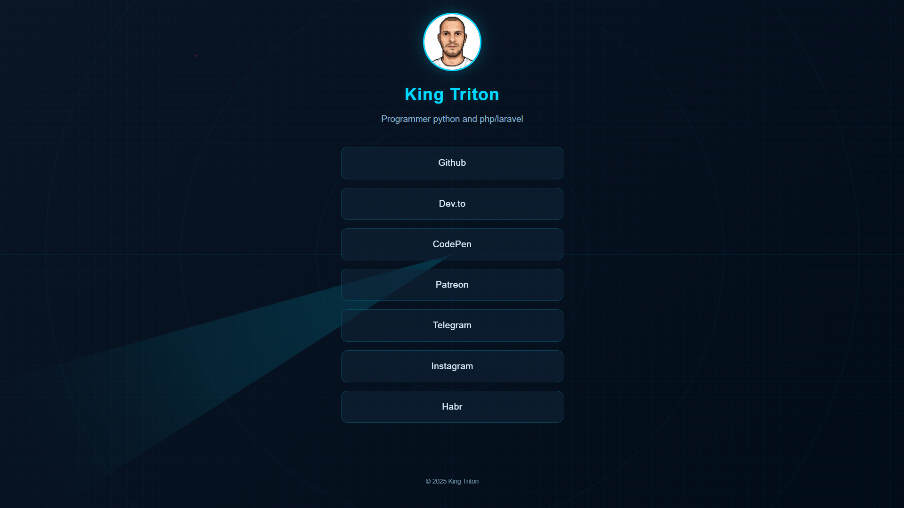
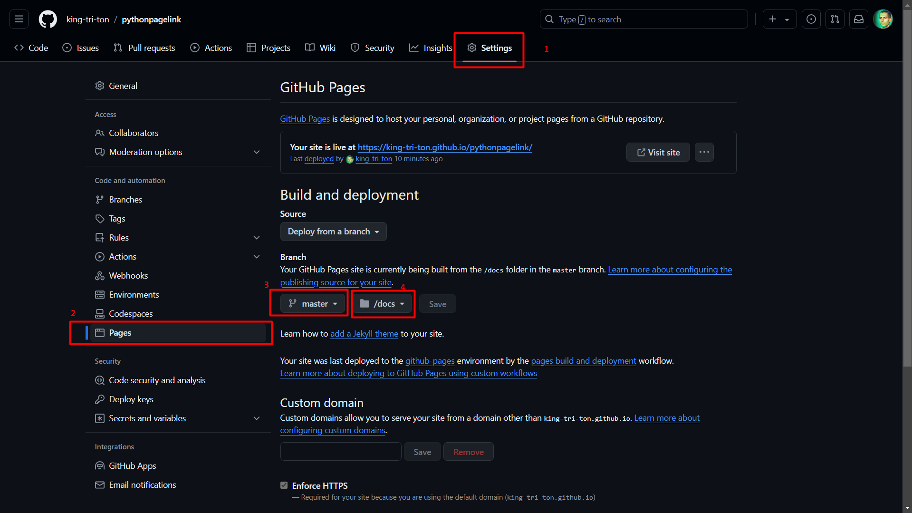

# PythonPageLink - Генератор персональных страниц со ссылками

Простой инструмент для создания собственного аналога LinkTree или TapLink. Проект позволяет создать статичный сайт со ссылками на ваши социальные сети и важные ресурсы, используя Python и GitHub Pages.



## Описание проекта

PythonPageLink — это генератор статических страниц, который преобразует ваши настройки из конфигурационного файла в готовую веб-страницу. Используя шаблонизатор Jinja2, скрипт создает персонализированную страницу со всеми вашими ссылками, которую можно разместить на GitHub Pages.

## Основные возможности

* **Управление ссылками через YAML** — все ссылки и описания хранятся в удобном для редактирования формате
* **Полная персонализация** — изменяйте фотографию, описание, оформление и тему сайта
* **Простое размещение** — готовый сайт легко публикуется на GitHub Pages

## Структура проекта

```
pythonpagelink/
├── config.yml              # Конфигурация сайта
├── gs.py                   # Скрипт генерации
├── requirements.txt        # Зависимости Python
├── themes/
│   └── custom/            # Пользовательская тема
│       ├── index.html     # HTML шаблон
│       └── assets/        # Ресурсы темы (CSS, JS, изображения)
└── docs/                  # Готовый сайт (создается автоматически)
```

## Установка

### Требования

- Python 3.7 или выше
- pip (менеджер пакетов Python)

### Шаги установки

1. Клонируйте репозиторий:

   ```bash
   git clone https://github.com/king-tri-ton/pythonpagelink.git
   cd pythonpagelink
   ```

2. Установите необходимые зависимости:

   ```bash
   pip install -r requirements.txt
   ```

## Настройка

### Конфигурация сайта

Откройте файл `config.yml` и укажите свои данные:

```yaml
name: "Ваше Имя"
picture: "assets/img/avatar.jpg"
bio: "Ваше описание или профессия"

meta:
  lang: "ru"
  description: "Описание для поисковых систем"
  title: "Заголовок страницы"
  author: "Автор сайта"
  siteUrl: "https://username.github.io/repository-name/"

links:
  - name: "GitHub"
    url: "https://github.com/username"
  - name: "Telegram"
    url: "https://t.me/username"
  - name: "Email"
    url: "mailto:your@email.com"

theme: "custom"
```

### Настройка темы

Файлы темы находятся в директории `themes/custom/`:

- **CSS** (`assets/css/styles.css`) — стили оформления
- **JavaScript** (`assets/js/script.js`) — интерактивные элементы
- **HTML** (`index.html`) — структура страницы
- **Изображения** (`assets/img/`) — аватар и другие изображения

## Генерация сайта

После настройки конфигурации запустите скрипт генерации:

```bash
python gs.py
```

Скрипт создаст директорию `docs` с готовым сайтом, который можно сразу разместить на GitHub Pages.

## Публикация на GitHub Pages



### Инструкция по публикации

1. Создайте новый публичный репозиторий на GitHub
2. Загрузите в него все файлы проекта, включая папку `docs`
3. Перейдите в настройки репозитория (Settings)
4. Откройте раздел Pages в боковом меню
5. В разделе "Source" выберите:
   - Branch: `main` (или `master`)
   - Folder: `/docs`
6. Нажмите "Save" и дождитесь публикации (обычно 1-2 минуты)

После успешной публикации ваш сайт будет доступен по адресу:

```
https://<username>.github.io/<repository-name>/
```

### Пример

Рабочий пример сайта доступен с темой **CPTS-J** по адресу:  
[https://king-tri-ton.github.io/pythonpagelink/](https://king-tri-ton.github.io/pythonpagelink/)

## Обновление сайта

При необходимости внести изменения:

1. Отредактируйте `config.yml` или файлы темы
2. Запустите `python gs.py` для повторной генерации
3. Загрузите обновленную папку `docs` в репозиторий
4. GitHub Pages автоматически обновит сайт

## Лицензия

Проект распространяется по лицензии [MIT](LICENSE).

## Контакты

По вопросам и предложениям:

- Telegram: [@king_tri_ton](https://t.me/king_tri_ton)
- Email: mdolmatov99@gmail.com

---

by **King Triton**